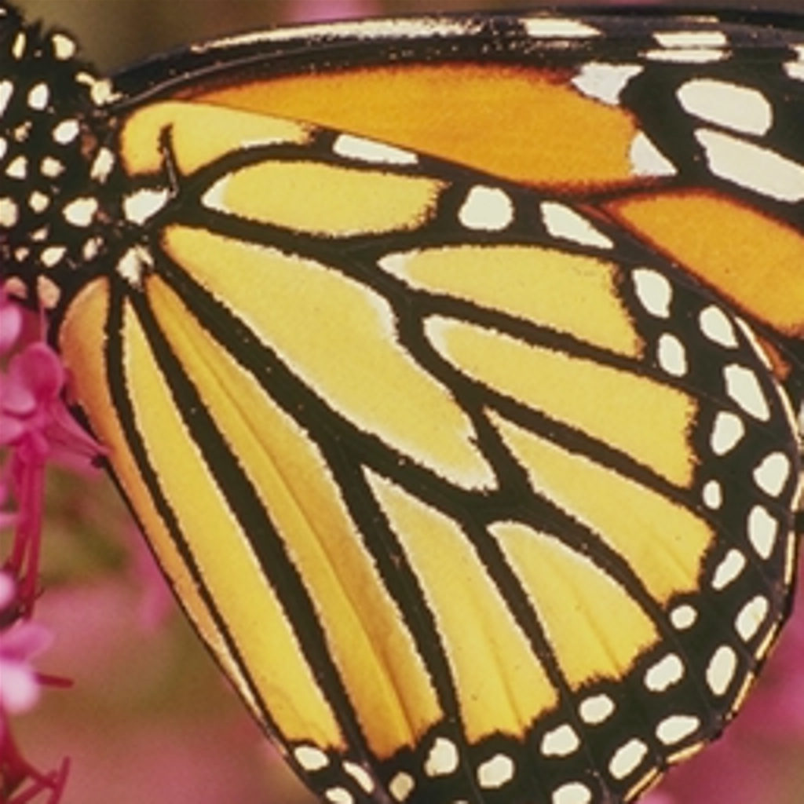

# [stb-image-frpf2](https://github.com/ImageProcessing-ElectronicPublications/stb-image-frpf2) demo

The image is scaled using "Find Replicant Pixel Fast".

## Origin


---

---

### Upsampling x2

```shell
stbimfrpf2 butterfly.png butterfly.x2frpf2.png 
```
```log 
Load: butterfly.png
image: 256x256:3
process: downsample
process: gradient
process: FRPF2
 region: all
 threshold: 0
Save png: butterfly.x2frpf2.png
```


### Upsampling x4

```shell
stbimfrpf2 butterfly.x2frpf2.png butterfly.x4frpf2.png 
```
```log 
Load: butterfly.x2frpf2.png
image: 256x256:3
process: downsample
process: gradient
process: FRPF2
 region: all
 threshold: 0
Save png: butterfly.x4frpf2.png
```


## Compare

### Bicubic

```shell
stbresize -r 4 butterfly.png butterfly.x4cubic.png
```
```log 
Load: butterfly.png
image: 256x256:3
resize: 1024x1024:3
method: bicubic
Save png: butterfly.x4cubic.png
```



### FRP2 (long!!!)

```shell
stbimfrp2 butterfly.png butterfly.x2frp2.png 
```
```log 
Load: butterfly.png
image: 256x256:3
process: downsample
process: gradient
process: FRP2
Save png: butterfly.x2frp2.png
```
```shell
stbimfrp2 butterfly.x2frp2.png butterfly.x4frp2.png 
```
```log 
Load: butterfly.x2frp2.png
image: 256x256:3
process: downsample
process: gradient
process: FRP2
Save png: butterfly.x4frp2.png
```


---

## Option radius find

Balance of execution time and quality of the result.

```shell
stbimfrpf2 -r 32 butterfly.png butterfly.x2frpf2.r32.png 
```
```log
Load: butterfly.png
image: 256x256:3
process: downsample
process: gradient
process: FRPF2
 region: 65x65
 threshold: 0
Save png: butterfly.x2frpf2.r32.png
```
```shell
stbimfrpf2 -r 32 butterfly.x2frpf2.r32.png butterfly.x4frpf2.r32.png 
```
```log
Load: butterfly.x2frpf2.r32.png
image: 512x512:3
process: downsample
process: gradient
process: FRPF2
 region: 65x65
 threshold: 0
Save png: butterfly.x4frpf2.r32.png
```
```shell
stbimfrpf2 -r 64 butterfly.x4frpf2.r32.png butterfly.x8frpf2.r32.png 
```
```log
Load: butterfly.x4frpf2.r32.png
image: 1024x1024:3
process: downsample
process: gradient
process: FRPF2
 region: 65x65
 threshold: 0
Save png: butterfly.x8frpf2.r32.png
```


```shell
stbimfrpf2 -r 64 butterfly.png butterfly.x2frpf2.r64.png 
```
```log
Load: butterfly.png
image: 256x256:3
process: downsample
process: gradient
process: FRPF2
 region: 129x129
 threshold: 0
Save png: butterfly.x2frpf2.r64.png
```
```shell
stbimfrpf2 -r 64 butterfly.x2frpf2.r64.png butterfly.x4frpf2.r64.png 
```
```log
Load: butterfly.x2frpf2.r64.png
image: 512x512:3
process: downsample
process: gradient
process: FRPF2
 region: 129x129
 threshold: 0
Save png: butterfly.x4frpf2.r64.png
```
```shell
stbimfrpf2 -r 64 butterfly.x4frpf2.r64.png butterfly.x8frpf2.r64.png 
```
```log
Load: butterfly.x4frpf2.r64.png
image: 1024x1024:3
process: downsample
process: gradient
process: FRPF2
 region: 129x129
 threshold: 0
Save png: butterfly.x8frpf2.r64.png
```


---

## Option threshold find

Balance of execution time and search accuracy.

```shell
stbimfrpf2 -t 16 butterfly.png butterfly.x2frpf2.t16.png 
```
```log
Load: butterfly.png
image: 256x256:3
process: downsample
process: gradient
process: FRPF2
 region: all
 threshold: 16
Save png: butterfly.x2frpf2.t16.png
```
```shell
stbimfrpf2 -t 16 butterfly.x2frpf2.t16.png butterfly.x4frpf2.t16.png 
```
```log
Load: butterfly.x2frpf2.t16.png
image: 512x512:3
process: downsample
process: gradient
process: FRPF2
 region: all
 threshold: 16
Save png: butterfly.x4frpf2.t16.png
```
```shell
stbimfrpf2 -t 16 butterfly.x4frpf2.t16.png butterfly.x8frpf2.t16.png 
```
```log
Load: butterfly.x4frpf2.t16.png
image: 1024x1024:3
process: downsample
process: gradient
process: FRPF2
 region: all
 threshold: 16
Save png: butterfly.x8frpf2.t16.png
```


---

---
